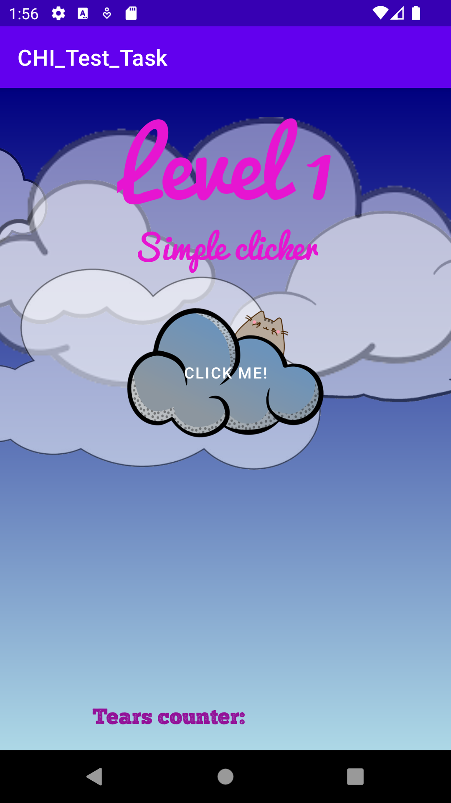
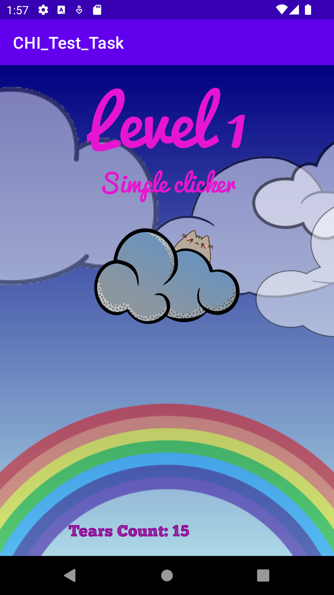

# Test task

-------------------
### 1 - Clicker
##### Program work:

##### Some screenshots: 

Actually it's a simple clicker with some event which happens after click: 

 * Cat hide from screen 
 * With 25% chance per click lighting can appear
 * Drops falling 
 * Counter increase number of clicks

And There is some auto animations: 
 * rainbow shows if you don't click
 * Clouds going from left side to right

Rainbow & Start Screen : 

  

